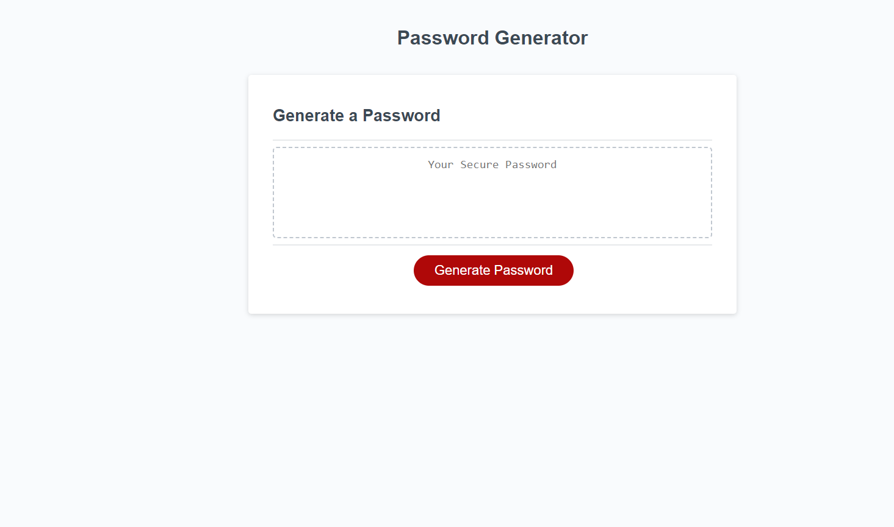

# Password Generator

## Password Generator
this website is a password generator. It uses Javascript to prompt the user for information with prompt and confirm actions. I used Javascript because it is the standard technology to use for a web application more complicated than normal HTML is prepared to do without involving database calls.

## Installation
This application runs in your browser and does not require installation.

Here is a screenshot and a link to the running website
[Password Generator](https://duckduckgo.com)

## Use
This project will allow users to generate secure passwords from 

## Future iterations
In future iterations of this project, I intend to 